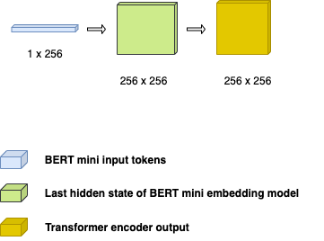
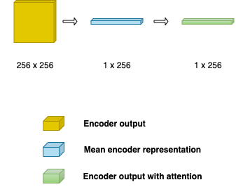
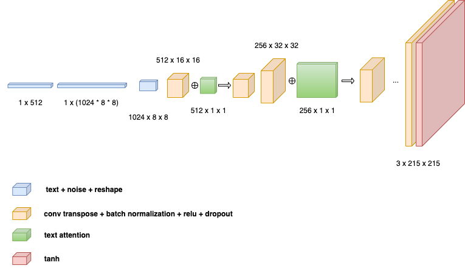
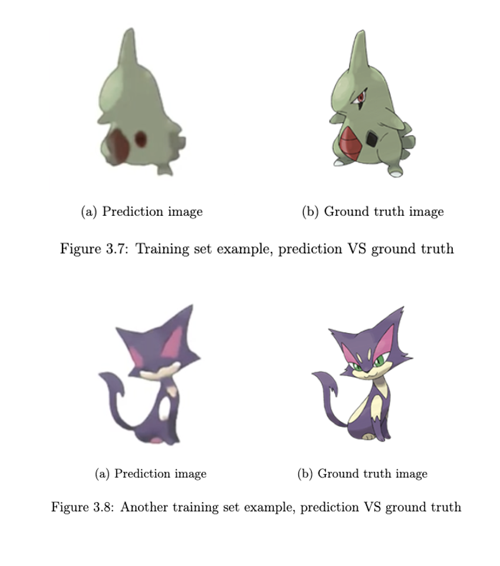
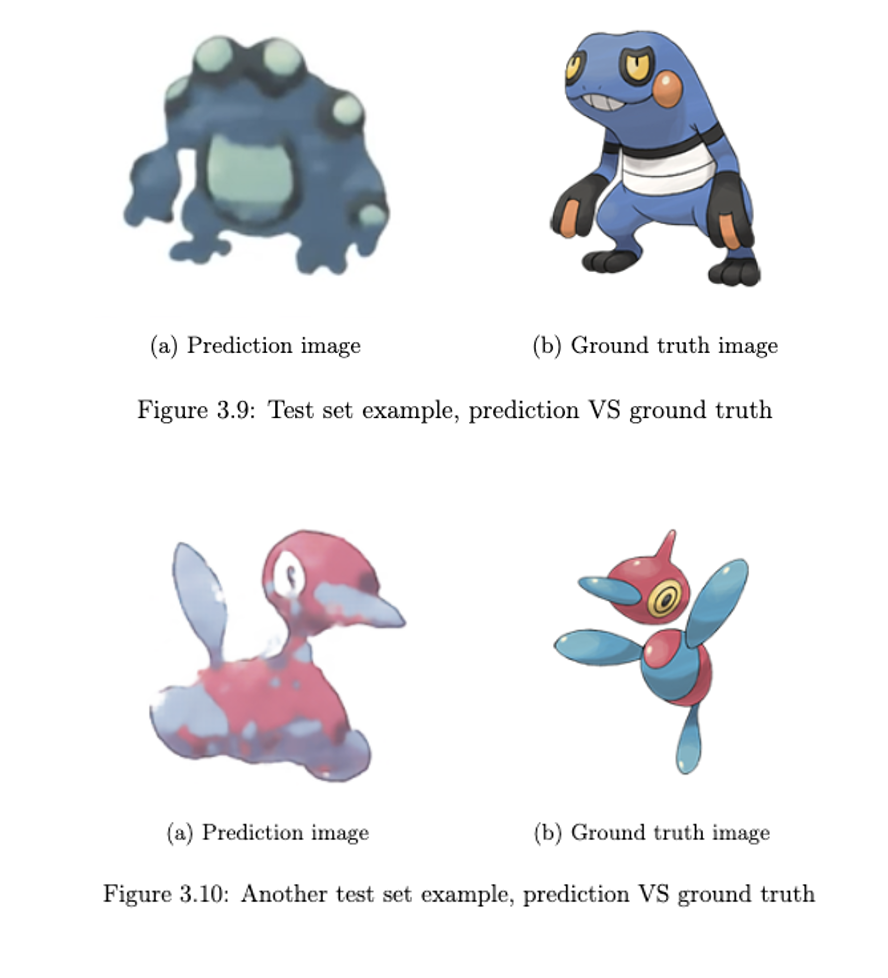

# PokemonAI

## Overview

PokemonAI is a deep learning model that takes text descriptions as input and generates corresponding Pokemon sprite images. The model uses transformer architecture with attention mechanisms to understand text descriptions and generate Pokemon sprites. Watch the demo on YouTube https://youtu.be/cmqSfGZoYtQ.

## Model Architecture

The PokemonAI model consists of:

- **Text Encoder**: Transformer-based encoder that processes text descriptions
- **Attention Mechanism**: Cross-attention layers that align text features with image generation
- **Image Decoder**: Generates Pokemon sprites from encoded text representations
- **Output Layer**: Produces 215x215 pixel Pokemon sprite images

### Architecture Schematics

Below are the schematic diagrams illustrating the core components of the model:

#### Encoder


#### Attention Mechanism


#### Decoder



## Installation

### 1. Clone the Repository

```bash
git clone https://github.com/mattiatritto/PokemonAI
cd PokemonAI
```

### 2. Set Up Virtual Environment

```bash
mkdir ../venv_pokemon
mkdir ../hf_cache
python3 -m venv ../venv_pokemon
source ../venv_pokemon/bin/activate
```

### 3. Install Dependencies

```bash
pip3 install --upgrade pip
pip3 install --no-cache-dir -r requirements.txt
```

### 4. Configure Environment Variables

```bash
export HF_HOME="/path/to/hf_cache"
export HUGGINGFACE_HUB_CACHE="/path/to/hf_cache"
export PYTHONPATH=/path/to/PokemonAI/src:$PYTHONPATH
```

## Model Setup

### Download Pre-trained Model

```bash
cd src/model
python3 download_bert.py
```

## Data Preprocessing

### Configure Preprocessing Parameters

Edit `src/preprocess/preprocess.py`:

```python
# Parameters to change
RANDOM_SEED = 42
NUM_AUGMENTS = 0
AUGMENT = False
```

### Run Preprocessing

```bash
cd src/preprocess
python3 preprocess.py
```

## Training

### Configure Training Parameters

Edit `src/train_and_evaluate/train.py`:

```python
# Hyperparameters
NUM_EPOCHS = 100
BATCH_SIZE = 10
RANDOM_SEED = 42
IMAGES_VAL = 10
PERCEPTUAL_LOSS_WEIGHT = 0

# Model Architecture
EMBEDDING_DIM = 256
N_HEADS_ENOCDER = 1
NUM_TRANSFORMER_ENCODER_LAYERS = 1
DIM_FEEDFORWARD_ENCODER = 512
DROPOUT_ENCODER = 0.3
NOISE_ENCODER = False

N_HEADS_ATTENTION = 1
DROPOUT_ATTENTION = 0.3
DECODER_DIM = 256

NOISE_DIM = 256
DROPOUT_DECODER = 0.3

CONTEXT_DIM = 256
OUTPUT_SIZE = 215

# Grid Search Parameters
GRID_PARAMETERS = {
    "learning_rate": [1e-4],
    "weight_decay": [1e-6]
}
```

### Start Training

```bash
cd src/train_and_evaluate
python3 train.py
```

## Inference

### Configure Gradio Web App

Edit `src/train_and_evaluate/gradio_app.py`:

```python
# Configuration for inference
EMBEDDING_DIM = 256
N_HEADS_ENOCDER = 1
NUM_TRANSFORMER_ENCODER_LAYERS = 1
DIM_FEEDFORWARD_ENCODER = 512
DROPOUT_ENCODER = 0
NOISE_ENCODER = False

N_HEADS_ATTENTION = 1
DROPOUT_ATTENTION = 0
DECODER_DIM = 256

NOISE_DIM = 256
DROPOUT_DECODER = 0

CONTEXT_DIM = 256
OUTPUT_SIZE = 215
CONFIG_NAME = "ft_lr_5e-05_wd_1e-06"
CHECKPOINT_DIR = "checkpoints"
```

### Launch Web Interface

```bash
cd src/train_and_evaluate
python gradio_app.py
```


## Some image examples

#### Train example

#### Test example
